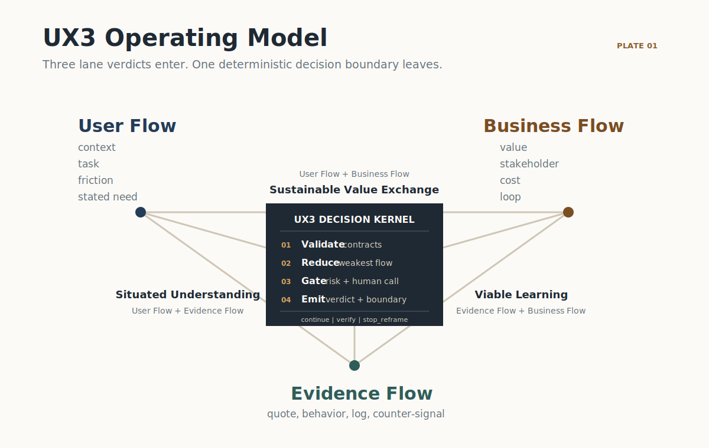
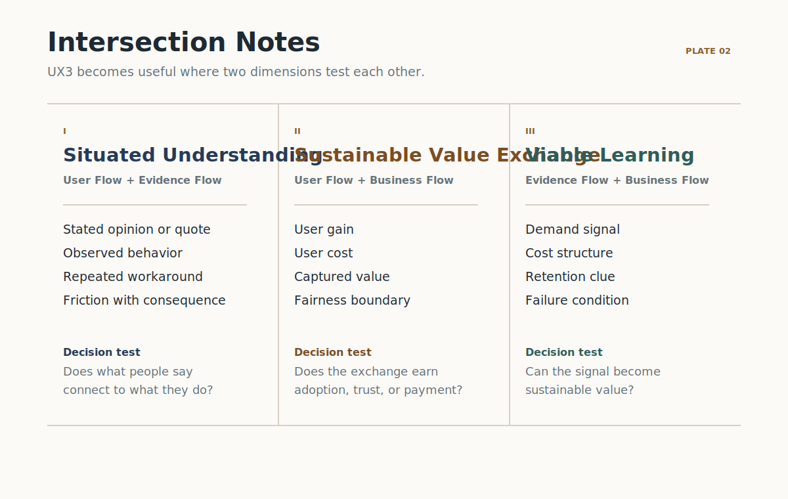

# UX3 Product Design Harness

Machine-enforced product judgment across the whole loop: direction, build,
launch, and user feedback.

<!-- locale-selector -->
## Read In / Work In

**Read in:** [English](README.md) |
[Traditional Chinese](i18n/zh-TW/README.md) |
[Simplified Chinese](i18n/zh-CN/README.md) |
[Japanese](i18n/ja/README.md) | [Korean](i18n/ko/README.md) |
[Spanish](i18n/es/README.md) | [French](i18n/fr/README.md) |
[German](i18n/de/README.md)

**Work in:** copy one invocation into the agent session.

```text
Use UX3 Product Design Harness for this repository.
Working language: en.
Review this product decision before implementation: <decision>.
```

Supported working-language lines: `Working language: en.`,
`Working language: zh-TW.`, `Working language: zh-CN.`,
`Working language: ja.`, `Working language: ko.`,
`Working language: es.`, `Working language: fr.`,
`Working language: de.`


UX3 Product Design Harness is the judgment layer for the whole product loop.
It gates the first "why build this?", stays on through spec, build, launch,
user testing, and feedback digestion, and returns one machine-checkable
verdict: `continue`, `verify`, or `stop_reframe`.

It is framework-agnostic: prompts, JSON Schemas, knowledge files, and agent
definitions that plug into any agent runtime. There is no server and no SDK.
The only dependency is `jsonschema`, used by `scripts/check_review.py` and
`scripts/validate.py` to validate review outputs and repository contracts.

The repository has two entrances to one knowledge system. Humans get the
project site and handbook; agents install the complete skill bundle at
`.agents/skills/product-design-harness/`, then use `llms.txt`, prompts,
schemas, rules, and golden examples. Both entrances use the same UX3 Decision
Kernel and the same canonical review contract.

## Community-built strategic design knowledge

Most design repositories improve a prototype, visual, or animation. UX3 works
at the strategic level: what should be built, for whom, based on what evidence,
under which business conditions, and with which human accountable for the
trade-off.

The community can contribute field experience, counterexamples, pressure
cases, decision rules, contracts, integrations, and translations. The preferred
contribution is not another opinion; it is a decision with User Flow, Evidence
Flow, Business Flow, Designer-in-the-Loop judgment, and an observed outcome.

- [Submit field evidence](.github/ISSUE_TEMPLATE/field_evidence.yml)
- [Propose a decision rule](.github/ISSUE_TEMPLATE/decision_rule.yml)
- [Read the contribution contract](CONTRIBUTING.md)
- [Understand decision rights](GOVERNANCE.md)

<!-- where-it-sits -->
## Where It Sits

Coding harnesses made agents reliable executors: tests, types, and CI guard
the how. Nothing guarded the why or the after. This harness is not a phase
before building; it is the judgment layer that runs across the loop.


<!-- why-install -->
## Why Install

The decision rules are machine-enforced, not prose. A malformed review, a
combined verdict that contradicts its lane verdicts, an execution boundary
whose may_do repeats a must_not_do entry, or a verdict that outruns its
evidence tier fails validation instead of shipping.
Every claim below is verifiable inside this repository:

| Claim | Verify at |
|---|---|
| One canonical machine contract for every review mode: `schemas/review-result.schema.json` (JSON Schema draft 2020-12, one of 16 schemas in the repo). | `schemas/review-result.schema.json` |
| Working-language setup is explicit while canonical identifiers remain English. | `schemas/session-config.schema.json` |
| Canonical UX3 definitions and rule IDs are loaded from machine files. | `knowledge/ontology.json`, `knowledge/rules.json` |
| 21 decision rule cards operationalize the current kernel; six newly distilled cards carry chapter-level provenance, including `ux3.rule.human_agent_interaction` and `ux3.rule.motivation_ethics`. | `knowledge/rules.json`, `knowledge/source-chapters.json`, `docs/DECISION-RULES.md` |
| JSON Schema enforces the output shape and verdict-specific conditional fields. | `schemas/review-result.schema.json`, `tests/test_contracts.py` |
| Verdict-specific fields are mutually exclusive: a `continue` result cannot carry a `reframed_question`. | `tests/test_contracts.py` |
| Challenge-round fields are forbidden in independent rounds and required in challenge rounds. | `schemas/reviewer-verdict.schema.json` |
| Every `stop_reframe` lane verdict must carry a machine-readable `stop_reason_class`. | `schemas/reviewer-verdict.schema.json` |
| actor_boundary.target_population is the single canonical target population source in reviews and context packs. | `schemas/actor-boundary.schema.json`, `schemas/review-result.schema.json`, `schemas/context-pack.schema.json` |
| `scripts/check_review.py` is the required canonical review validator; it applies the worst-verdict, weakest-flow, and headline-tier semantic checks after JSON Schema validation. | `scripts/check_review.py`, `docs/CONTRACTS.md`, `tests/test_contracts.py` |
| Evidence receipts require provenance, freshness, a counter-signal, and a tier from `t0` to `t4`. | `schemas/evidence.schema.json` |
| Once a review declares a human-owned decision, the trail is enforced in both directions: decision record id, accountable owner, and reversal conditions. The declaration itself is the reviewing agent's call and cannot be forced by schema. | `schemas/human-decision.schema.json`, `schemas/review-result.schema.json` |
| Verdicts are bounded by evidence tier: a `t0` headline tier forces `stop_reframe`, and `t1` can never return `continue`. | `schemas/review-result.schema.json`, `tests/test_semantic_guards.py` |
| A council review with a vacuous challenge round (every challenge objecting to nothing) fails validation. | `scripts/check_review.py`, `tests/test_semantic_guards.py` |
| Golden examples for all three modes validate against the canonical contract. | `examples/quick-gate-review.json`, `examples/standard-gate-review.json`, `examples/ux3-council-review.json` |

<!-- ux3-model -->
## What The Harness Cannot Enforce

Honesty about the boundary, because evaluating agents will test it:

- It validates the shape and internal consistency of evidence receipts, not
  their truth. A fabricated receipt with plausible fields passes.
- It enforces the human-decision trail only after a review declares a
  decision human-owned. An agent that misclassifies a human-owned case as
  `none` is not caught by schema.
- It requires three lane reviews but cannot prove they were performed
  independently.

Everything the harness does enforce is listed above and covered by tests.

## UX3 Model



Three flows are reviewed separately and interpreted together:

| Flow | Definition |
|---|---|
| User Flow | Who the product is for, who is affected, what they are trying to accomplish, and what cost, friction, risk, or loss of control exists now. |
| Evidence Flow | What source, signal, interpretation, counter-signal, and decision impact support the next step. |
| Business Flow | Who creates value, receives value, pays, decides, operates, absorbs risk, and whether the exchange can stay viable and legitimate. |

UX3 is strongest at four intersections:

| Intersection | Canonical id | Meaning |
|---|---|---|
| User Flow + Evidence Flow | `user_evidence` | Situated Understanding: separate opinion, behavior, workaround, simulation, and stronger proof still needed. |
| Evidence Flow + Business Flow | `evidence_business` | Viable Learning: connect signals to business consequence, hidden cost, retention, and failure criteria. |
| User Flow + Business Flow | `user_business` | Sustainable Value Exchange: compare user gain, user cost, business capture, and fairness. |
| Center | `ux3_decision_kernel` | UX3 Decision Kernel: Validate, Reduce, Gate, and Emit one bounded result. |

The UX3 Decision Kernel does not average lane scores or invent a fourth
opinion. It validates contracts, reduces to the worst verdict, gates
uncertainty and human-owned calls, then emits the canonical review result.
Human-owned calls are recorded; they are not converted into an evidence score.



<!-- review-modes -->
## Review Modes

Start every review at `prompts/start-review.md`; it selects the smallest
responsible mode.

| Mode | Use when |
|---|---|
| Quick Gate | Small, reversible, low-risk change. |
| Standard Gate | New feature, workflow, or experiment. |
| UX3 Council | High uncertainty, external evidence, meaningful risk, multiple reviewers, or a human-owned trade-off. |

Six gates frame the process: Stage, User Flow, Evidence Flow, Business Flow,
Council, and Human Judgment. See `docs/OPERATING-PROTOCOL.md`.

<!-- live-coding-quickstart -->
## Install, Verify, And Handoff

Install the Skill directly into supported agent environments:

```text
npx skills add cis2042/product-design-harness -g -y
```

If the repository is private, use an authenticated GitHub SSH remote:

```text
npx skills add git@github.com:cis2042/product-design-harness.git -g -y
```

To inspect and verify the complete repository locally:

```text
git clone <repo-url> product-design-harness
cd product-design-harness
python3 -m venv .venv
.venv/bin/python -m pip install -r requirements-dev.txt
.venv/bin/python -m unittest discover -s tests
.venv/bin/python scripts/validate.py
.venv/bin/python scripts/check_review.py examples/quick-gate-review.json
```

Preview the website and UTF-8 documentation with the repository server:

```text
.venv/bin/python scripts/serve.py
```

Then wire it into your agent:

1. Load `.agents/skills/product-design-harness/SKILL.md` as the harness skill
   or system instruction. Its `resources/` directory must stay beside it.
2. Load `resources/schemas/session-config.schema.json`,
   `resources/knowledge/ontology.json`, `resources/knowledge/rules.json`,
   then `resources/prompts/start-review.md`.
3. Validate every review output with `resources/scripts/check_review.py`; JSON Schema
   alone checks shape and conditionals, while `check_review.py` also checks the
   weakest-flow and headline-tier rules.
4. Compare your first outputs to `resources/examples/quick-gate-review.json`,
   `resources/examples/standard-gate-review.json`, and
   `resources/examples/ux3-council-review.json`.

Live-coding boundary: review and implementation are separate. `verify`
authorizes only the exact proof step. `continue` plus a valid
`templates/context-pack.md` authorizes implementation inside the named
execution boundary. `stop_reframe` blocks implementation and returns a better
product question.

<!-- working-language -->
## Working Language

Reading language and working language are separate choices. `working_language`
controls human-readable prompts, questions, explanations, summaries, and
free-text output fields.

It does not translate JSON property names, enum values, rule IDs, schema IDs,
file paths, evidence IDs, or canonical verdicts: `continue`, `verify`,
`stop_reframe`.

Session configuration keeps machine identifiers English:

```json
{
  "working_language": "en",
  "canonical_identifiers": "en",
  "fallback_language": "en"
}
```

If a requested working language is unsupported, use English and state the
fallback. If a translation conflicts with the English kernel, the English
rule controls and the translation is marked for correction.

<!-- canonical-contracts -->
## Canonical Contracts

| Path | Purpose |
|---|---|
| `.agents/skills/product-design-harness/SKILL.md` | Installable skill entrypoint; includes all runtime resources. |
| `SKILL.md` | Source contract for repository readers; marked internal so the installer selects the complete bundle. |
| `llms.txt` | Machine-readable repository index. |
| `schemas/session-config.schema.json` | Working-language contract; `working_language`, `canonical_identifiers`, and `fallback_language`. |
| `schemas/review-result.schema.json` | Canonical review result for `continue`, `verify`, and `stop_reframe`. |
| `knowledge/ontology.json` | Canonical UX3 flows, intersections, actors, stakeholders, and human judgment terms. |
| `knowledge/rules.json` | 21 canonical rule cards, including `ux3.rule.actor_boundary`, with trigger, evidence, counter-signal, human boundary, stop condition, and output; newly distilled cards also cite source chapters. |
| `knowledge/source-chapters.json` | Chapter manifest and source checksum for newly distilled curriculum provenance. |
| `prompts/start-review.md` | Review entry prompt and mode selector. |
| `templates/context-pack.md` | Handoff artifact created only after `continue`. |
| `docs/HARNESS.md` | Complete English handbook. |
| `docs/UX3.md` | UX3 model, intersections, and the UX3 Decision Kernel. |
| `docs/ADOPTION.md` | Install and integration guide for agent teams. |
| `docs/CONTRACTS.md` | Output fields and weakest-flow logic. |
| `press-kit/PRESS-KIT.md` | Social cards and talking points for anyone presenting the harness. |

UX3 Product Design Harness does not promise good outcomes. It enforces that
every build decision states its evidence, its weakest flow, its trade-offs,
and its accountable human owner before execution starts.
