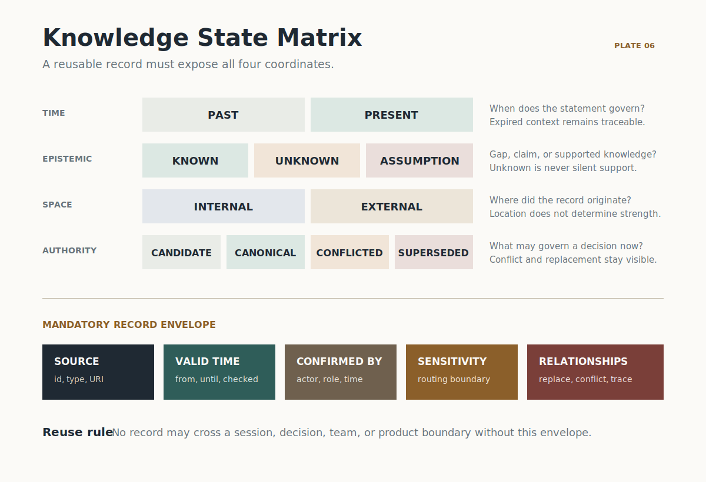

# Knowledge State Matrix

Product teams do not only collect information. They decide what may be reused,
for which decision, for how long, and under whose authority.

The Knowledge State Matrix gives every durable knowledge record four explicit
coordinates. A coordinate is a classification, not a score. No strong value on
one dimension can erase weakness or ambiguity on another.

## Four Dimensions

| Dimension | States | Decision question |
|---|---|---|
| Time | `past`, `present` | Does this describe a completed context or the context currently governing the decision? |
| Epistemic state | `known`, `unknown`, `assumption` | Is this supported knowledge, an explicit gap, or a claim waiting for proof? |
| Space | `internal`, `external` | Does the record originate inside the product system or outside the organization and workflow? |
| Authority status | `candidate`, `canonical`, `conflicted`, `superseded` | Is this proposed, formally adopted, disputed by another record, or replaced? |

The dimensions stay independent. An internal record is not automatically more
authoritative. A present record is not automatically true. A canonical record
may still be an explicitly adopted assumption. Authority describes governance;
epistemic state describes what is known.

## Mandatory Record Envelope

Every retained or reused knowledge record must preserve:

| Field | Why it is required |
|---|---|
| Source | Makes the origin inspectable and prevents unattributed claims from becoming organizational memory. |
| Valid time | Defines when the statement applies and when it must be checked again. |
| Confirmed by | Names the person or accountable role that accepted the classification. |
| Sensitivity level | Controls where the record may travel and which agents or people may read it. |
| Supersession relationships | Preserves what the record replaces, what replaced it, and which records conflict with it. |

Use `schemas/knowledge-record.schema.json` for the machine contract and
`examples/knowledge-record.json` as a valid reference.

## Agent Decision Logic

1. Classify all four dimensions before reusing a record.
2. Treat `unknown` as an evidence request, never as support.
3. Treat `assumption` as a claim to verify, not as proof.
4. Use `canonical` only within the stated valid time, context, and sensitivity boundary.
5. Surface every `conflicted` record with its conflicting record ids; do not choose a side silently.
6. Keep `superseded` records for traceability, but do not use them as current support.
7. When a source expires or the context changes, reclassify the record instead of overwriting history.
8. Require a named human to confirm promotion to `canonical`, conflict resolution, and supersession.

## State Transitions

| Trigger | Required transition |
|---|---|
| A gap is stated as a testable claim | `unknown` to `assumption` |
| Adequate evidence supports the claim | `assumption` to `known` |
| Evidence expires or a material counter-signal appears | `known` to `assumption` or `conflicted` |
| An accountable owner adopts a record | `candidate` to `canonical` |
| Two material records cannot both govern the same decision | current authority status to `conflicted` |
| A newer record formally replaces an older one | old record to `superseded`; new record records `supersedes` |
| The valid context ends | `present` to `past` |

Transitions are append-only decisions. Update the current record state and keep
the relationship ids needed to reconstruct how the decision changed.

## Scope Boundary

This contract applies when information becomes durable product knowledge: it is
stored for reuse across sessions, decisions, teams, or products. Temporary
working notes may remain transient. Once an agent cites or reuses a note as
decision support, it must be promoted into a valid knowledge record.
