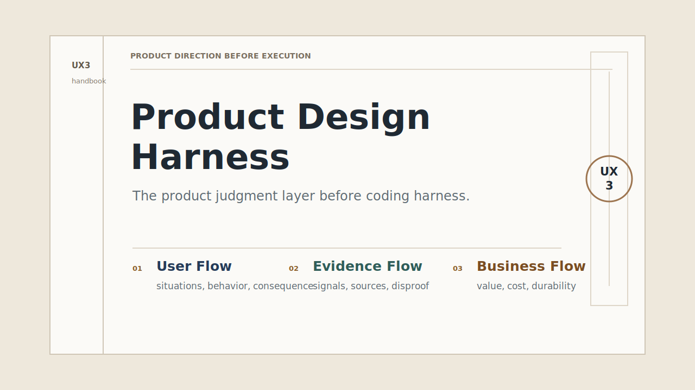
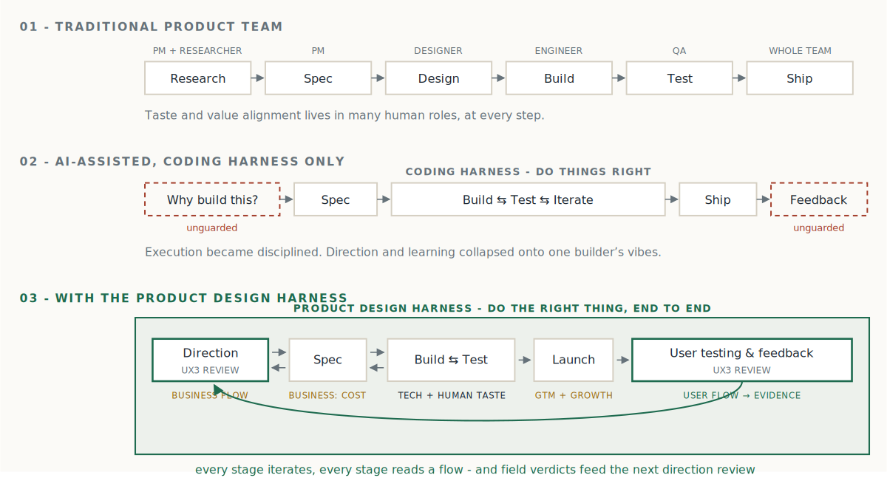

# UX3 Product Design Harness

제품 방향, 구현, 출시, 피드백 루프를 기계가 검증할 수 있는 판단으로 만든다.

<!-- locale-selector -->
## 읽을 언어 / 작업 언어

**Read in:** [English](../../README.md) | [繁體中文](../zh-TW/README.md) |
[简体中文](../zh-CN/README.md) | [日本語](../ja/README.md) |
[한국어](README.md) | [Español](../es/README.md) |
[Français](../fr/README.md) | [Deutsch](../de/README.md)

**Work in:** 이 호출문을 agent session 에 복사한다.

```text
Use UX3 Product Design Harness for this repository.
Working language: ko.
Review this product decision before implementation: <decision>.
```

완전한 기술 기준은 영어 문서다: [canonical English README](../../README.md),
[English handbook](../../docs/HARNESS.md).



UX3 Product Design Harness 는 제품 루프의 판단 계층이다. "왜 만드는가"에서
시작해 명세, 구현, 출시, 사용자 테스트, 피드백 정리까지 다루며
기계가 확인할 수 있는 판단인 `continue`, `verify`, `stop_reframe` 를
반환한다.

prompt, JSON Schema, 지식 파일, agent 정의로 구성되며 특정 framework, server,
SDK 에 종속되지 않는다. 사람은 사이트와 handbook, agent 는
`skills/product-design-harness/` 완전 bundle 을 설치한 뒤 `llms.txt`,
prompts, schemas, rules, golden examples 를 사용한다. 두 입구는 같은
UX3 Decision Kernel 과 canonical review contract 를 공유한다.

<!-- where-it-sits -->
## Harness 의 위치

Coding harness 는 테스트, 타입, CI 로 "어떻게 만들지"를 지킨다. Product Design Harness 는
"왜 만드는지"와 "만든 뒤 어떻게 판단할지"를 지키는 제품 루프 전체의 판단 계층이다.



<!-- why-install -->
## 설치하는 이유

결정 규칙은 산문이 아니라 기계로 강제된다. 형식이 잘못된 review, lane 판정과 모순되는 combined verdict, may_do와 must_not_do에 동일 항목이 있는 execution boundary, evidence tier의 권한을 넘는 verdict는 출시 전에 검증에서 차단된다.

| 주장 | 검증 위치 |
|---|---|
| 모든 mode 는 16 schema 중 `schemas/review-result.schema.json` 을 공유한다. | `schemas/review-result.schema.json` |
| 작업 언어는 명시하고 canonical identifiers 는 영어를 유지한다. | `schemas/session-config.schema.json` |
| UX3 정의와 rule IDs 는 기계 파일에서 읽는다. | `knowledge/ontology.json`, `knowledge/rules.json` |
| 21 decision rule cards 가 kernel 을 실행 규칙으로 만들며 새 rule 여섯 개는 장별 출처를 갖는다. | `knowledge/rules.json`, `knowledge/source-chapters.json`, `docs/DECISION-RULES.md` |
| JSON Schema 가 출력 형태와 verdict 조건을 강제한다. | `schemas/review-result.schema.json`, `tests/test_contracts.py` |
| `continue` 와 `reframed_question` 같은 verdict 전용 필드는 상호 배타적이다. | `tests/test_contracts.py` |
| Challenge 필드는 challenge round 에서 필수이고 independent round 에서 금지된다. | `schemas/reviewer-verdict.schema.json` |
| `stop_reframe` lane 에는 `stop_reason_class` 가 필요하다. | `schemas/reviewer-verdict.schema.json` |
| actor_boundary.target_population 이 목표 집단의 유일한 canonical source 다. | `schemas/actor-boundary.schema.json`, `schemas/review-result.schema.json`, `schemas/context-pack.schema.json` |
| `scripts/check_review.py` 가 worst-verdict, weakest-flow, headline-tier 를 검사한다. | `scripts/check_review.py`, `docs/CONTRACTS.md`, `tests/test_contracts.py` |
| Evidence receipt 는 provenance, freshness, counter-signal, `t0`~`t4` tier 를 요구한다. | `schemas/evidence.schema.json` |
| review가 결정을 human-owned로 선언하는 순간, decision record id, accountable owner, reversal conditions의 양방향 추적이 강제된다. 선언 자체는 검토 agent의 판단이며 schema로 강제할 수 없다. | `schemas/human-decision.schema.json`, `schemas/review-result.schema.json` |
| verdict는 evidence tier에 구속된다: headline tier가 `t0`이면 `stop_reframe`이 강제되고, `t1`은 결코 `continue`를 반환할 수 없다. | `scripts/check_review.py`, `tests/test_semantic_guards.py` |
| challenge round가 유명무실한 council review(모든 challenge가 어떤 lane에도 이의를 제기하지 않음)는 검증에 실패한다. | `scripts/check_review.py`, `tests/test_semantic_guards.py` |
| 세 mode 의 golden examples 가 canonical contract 를 통과한다. | `examples/quick-gate-review.json`, `examples/standard-gate-review.json`, `examples/ux3-council-review.json` |

<!-- ux3-model -->
## 이 harness가 강제할 수 없는 것

평가하는 agent는 반드시 직접 검증하므로, 경계에 대해 정직하게:

- evidence receipt의 형식과 내부 일관성을 검증할 뿐, 진실성은 검증하지 않는다. 그럴듯한 필드를 가진 조작된 receipt는 통과한다.
- human-decision 추적은 review가 결정을 human-owned로 선언한 후에만 강제된다. human-owned 사안을 `none`으로 잘못 분류하는 agent를 schema는 잡아내지 못한다.
- 세 개의 lane review를 요구하지만, 그것들이 독립적으로 수행되었음은 증명할 수 없다.

harness가 실제로 강제하는 모든 항목은 위에 나열되어 있으며 테스트로 보장된다.

## UX3 모델

세 flow 를 따로 검토한 뒤 함께 해석한다.

| Flow | 정의 |
|---|---|
| User Flow | 누가 쓰고, 누가 영향을 받으며, 무엇을 달성하려는지와 현재 비용, 마찰, 위험, 통제 상실을 본다. |
| Evidence Flow | 어떤 source, signal, interpretation, counter-signal, decision impact 가 다음 단계를 지지하는지 본다. |
| Business Flow | 누가 가치를 만들고, 받고, 지불하고, 결정하고, 운영하고, 위험을 부담하며, 교환이 지속 가능하고 정당한지 본다. |

네 교차점:

| 교차점 | Canonical id | 의미 |
|---|---|---|
| User Flow + Evidence Flow | `user_evidence` | Situated Understanding: 의견, 행동, 우회 방법, simulation, 더 필요한 증거를 분리한다. |
| Evidence Flow + Business Flow | `evidence_business` | Viable Learning: signal 을 사업 결과, 숨은 비용, retention, 실패 조건에 연결한다. |
| User Flow + Business Flow | `user_business` | Sustainable Value Exchange: user gain, user cost, business capture, fairness 를 비교한다. |
| Center | `ux3_decision_kernel` | UX3 Decision Kernel: Validate, Reduce, Gate, Emit 으로 경계 있는 결과를 낸다. |

UX3 Decision Kernel 은 각 심사 레인의 점수를 평균 내지 않고 네 번째 의견을 만들지
않는다. contract 를 검증하고, 가장 엄격한 판단으로 줄이며, 불확실성과
인간이 책임지는 판단을 gate 한 뒤 canonical review result 를 낸다.

<!-- review-modes -->
## Review 모드

모든 review 는 `prompts/start-review.md` 에서 시작하고 가장 작은 책임 있는
mode 를 고른다.

| Mode | 사용할 때 |
|---|---|
| Quick Gate | 작고, 되돌릴 수 있고, 위험이 낮은 변경. |
| Standard Gate | 새 기능, workflow, experiment. |
| UX3 Council | 높은 uncertainty, 외부 evidence, 의미 있는 risk, 여러 reviewer, 또는 human-owned trade-off. |

여섯 gate 는 Stage, User Flow, Evidence Flow, Business Flow, Council, Human Judgment 이며 단계, 사용자, 증거, 비즈니스, 숙의, 인간 책임을 나누어 확인한다.

<!-- live-coding-quickstart -->
## 설치, 검증, Live Coding 경계

지원 agent 환경에 직접 설치한다.

```text
npx skills add cis2042/product-design-harness -g -y
```

전체 repo 를 검사하고 검증하려면:

```text
git clone <repo-url> product-design-harness
cd product-design-harness
python3 -m venv .venv
.venv/bin/python -m pip install -r requirements-dev.txt
.venv/bin/python -m unittest discover -s tests
.venv/bin/python scripts/validate.py
.venv/bin/python scripts/check_review.py examples/quick-gate-review.json
```

repo server 로 웹사이트와 UTF-8 문서를 미리 본다.

```text
.venv/bin/python scripts/serve.py
```

agent 에 연결할 때는 `skills/product-design-harness/SKILL.md` 를 로드하고
같은 위치의 `resources/` 를 유지한다. 그 뒤
`resources/schemas/session-config.schema.json`, `resources/knowledge/ontology.json`,
`resources/knowledge/rules.json`, `resources/prompts/start-review.md` 순서로 사용한다.
모든 출력은 `resources/schemas/review-result.schema.json` 으로 검증한다.

Live-coding handoff boundary: review 는 implementation 이 아니다. `verify`
는 exact proof step 만 허용한다. `continue` 와 유효한
`templates/context-pack.md` 가 있어야 execution boundary 안에서 구현할 수
있다. `stop_reframe` 은 구현을 막고 더 나은 제품 질문을 요구한다.

<!-- working-language -->
## 작업 언어

읽을 언어와 작업 언어는 다르다. `working_language` 는 사람이 읽는 prompt,
질문, 설명, 요약, free-text output fields 를 제어한다.

번역하지 않는 것: JSON property names, enum values, rule IDs, schema IDs,
file paths, evidence IDs, canonical verdicts 인 `continue`, `verify`,
`stop_reframe`.

```json
{
  "working_language": "ko",
  "canonical_identifiers": "en",
  "fallback_language": "en"
}
```

지원하지 않는 작업 언어는 English 로 fallback 한다. 번역이 English kernel 과 충돌하면 영어 규칙이 우선한다.

<!-- canonical-contracts -->
## Canonical contracts

| Path | 목적 |
|---|---|
| `skills/product-design-harness/SKILL.md` | 완전한 runtime resources 를 포함한 installable skill entrypoint. |
| `llms.txt` | 기계가 읽는 repo index. |
| `schemas/session-config.schema.json` | `working_language`, `canonical_identifiers`, `fallback_language`. |
| `schemas/review-result.schema.json` | `continue`, `verify`, `stop_reframe` 의 canonical review result. |
| `knowledge/ontology.json` | User Flow, Evidence Flow, Business Flow, intersections, human judgment terms. |
| `knowledge/rules.json` | `ux3.rule.actor_boundary` 를 포함한 21 canonical rule cards. |
| `knowledge/source-chapters.json` | 교재 장 manifest 와 source checksum. |
| `prompts/start-review.md` | Review entry 와 mode selector. |
| `templates/context-pack.md` | `continue` 이후에만 만드는 handoff artifact. |
| `docs/HARNESS.md` | 영어 전체 handbook. |
| `docs/UX3.md` | UX3 model, intersections, UX3 Decision Kernel. |
| `docs/ADOPTION.md` | 설치와 통합 가이드. |
| `docs/CONTRACTS.md` | 출력 필드와 weakest-flow logic. |
| `press-kit/PRESS-KIT.md` | harness를 소개하는 사람을 위한 소셜 카드와 토킹 포인트. |

UX3 Product Design Harness 는 성공을 보장하지 않는다. 모든 build decision 이 실행 전에
evidence, weakest flow, trade-off, 책임지는 human owner 를 밝히게 한다.
